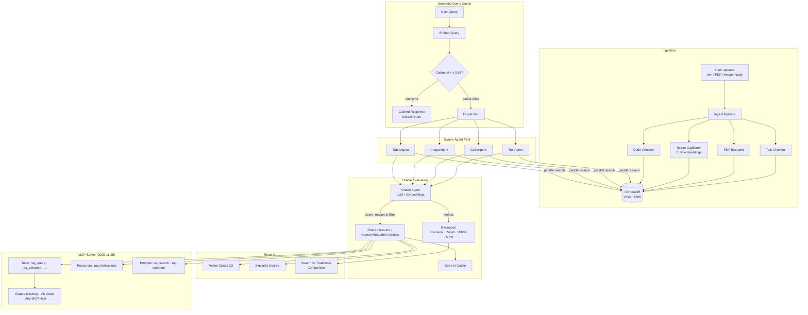
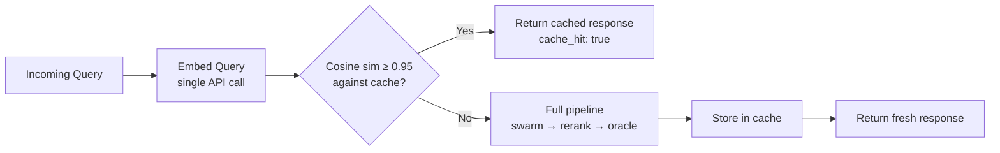

# rag-swarm

**Swarm Agent RAG** — A multimodal retrieval-augmented generation system where specialized swarm agents search a vector database in parallel, and an LLM-powered oracle evaluates every result's relevance, explains its reasoning back to the user, and filters out noise — so you only see what actually answers your question.

Exposed as both a REST API and an **MCP server** (Model Context Protocol, spec 2025-11-25), so any MCP-compatible host — Claude Desktop, VS Code Copilot, Claude Code — can query the knowledge base directly.

Inspired by [Karpathy's LLM Wiki](https://gist.github.com/karpathy/442a6bf555914893e9891c11519de94f) three-layer architecture, adapted for swarm-based vector retrieval with enterprise evaluation.

---

## Architecture



## Key Features

- **Multimodal ingestion** — text, PDF, images, code files with modality-specific chunking
- **Swarm retrieval** — parallel specialized agents instead of single-retriever RAG
- **Oracle evaluation** — two-stage (embedding + LLM) relevance scoring that explains its reasoning back to the user, filters noise, and flags provenance drift
- **MCP server** — Model Context Protocol (2025-11-25) interface with tools, resources, and prompts — plug into Claude Desktop, VS Code, or any MCP host
- **Visual proof** — 2D vector projections, similarity heatmaps, side-by-side comparison
- **Enterprise-ready** — configurable agent pools, async processing, evaluation pipeline
- **Cloudflare Workers AI** — all inference (embeddings, LLM, VLM, re-ranker) via Cloudflare REST API — no local GPU needed
- **Semantic query cache** — in-memory cache keyed by query embedding cosine similarity; repeat or near-duplicate queries skip all downstream API calls and return instantly

## Frontend

The React UI provides a full visual dashboard for querying, comparing retrieval approaches, and inspecting oracle reasoning.

### Comparison Dashboard

Swarm vs Traditional metrics (Precision, Recall, NDCG, MRR), bar chart and radar chart, pipeline step visualization, and active agent status.


### Results Side-by-Side

Swarm agent results (left) with oracle verdicts vs Traditional retriever results (right), showing chunk content, scores, modality tags, and source metadata.


### Oracle Verdicts

Per-chunk oracle evaluation with pass/fail status, relevance scores, and human-readable reasoning for every result.


---

## Quick Start

```bash
# 1. Install backend
cd backend
pip install -r requirements.txt

# 2. Start the API server
uvicorn app.main:app --reload --port 8000

# 3. Install and start the UI
cd ../frontend
npm install && npm run dev

# 4. Open http://localhost:5173
```

### API Endpoints

| Endpoint | Method | Description |
|---|---|---|
| `/ingest` | POST | Upload and index documents (multimodal) |
| `/query` | POST | Swarm agent retrieval with oracle evaluation |
| `/query-traditional` | POST | Single-retriever baseline for comparison |
| `/compare` | POST | Side-by-side swarm vs traditional with metrics |
| `/collections` | GET | List indexed collections and stats |
| `/cache/stats` | GET | Cache hit/miss counts, hit rate, config |
| `/cache/clear` | DELETE | Evict all cached entries |

### Example: Ingest sample data

```bash
curl -s -X POST "http://localhost:8000/ingest-sample" \
  -H "Content-Type: application/json" \
  -d '{"collection": "default"}' | python3 -m json.tool
```

```json
{
    "collection": "default",
    "documents_processed": 7,
    "chunks_created": 32,
    "modalities": ["code", "image", "table", "text"]
}
```

### Example: Swarm query with oracle evaluation

```bash
curl -s -X POST "http://localhost:8000/query" \
  -H "Content-Type: application/json" \
  -d '{"query": "what is swarm intelligence?", "collection": "default", "top_k": 10}' \
  | python3 -m json.tool
```

<details>
<summary>Response (truncated)</summary>

```json
{
    "query": "what is swarm intelligence?",
    "results": [
        {
            "chunk_id": "text_d79e510f285e",
            "content": "# Multi-Agent Systems and Swarm Intelligence\n\n## Swarm Intelligence\n\nSwarm intelligence refers to the collective behavio...",
            "modality": "text",
            "score": 1,
            "metadata": {
                "filename": "swarm-intelligence.md",
                "modality": "text",
                "embed_model": "@cf/baai/bge-base-en-v1.5"
            },
            "agent": "TextAgent"
        },
        {
            "chunk_id": "text_c500c9b79d38",
            "content": "— The collective behavior is more capable than the sum of individual agents. ## Swarm RAG Architecture...",
            "modality": "text",
            "score": 0.5402,
            "metadata": {
                "filename": "swarm-intelligence.md",
                "modality": "text"
            },
            "agent": "TextAgent"
        },
        {
            "chunk_id": "code_8fa0f6a72c45",
            "content": "\"\"\"Example: Swarm RAG retrieval agent implementation...",
            "modality": "code",
            "score": 0.5219,
            "metadata": {
                "filename": "example_agent.py",
                "modality": "code"
            },
            "agent": "CodeAgent"
        }
    ],
    "oracle_verdicts": [
        {
            "chunk_id": "text_d79e510f285e",
            "relevance_score": 1,
            "reasoning": "This chunk is RELEVANT as it directly answers the query with a clear definition of swarm intelligence and provides supporting information on its key principles.",
            "passed": true
        },
        {
            "chunk_id": "text_c500c9b79d38",
            "relevance_score": 0.5241,
            "reasoning": "This chunk is RELEVANT as it directly mentions 'Swarm RAG' and describes its application in the context of knowledge graph traversal during retrieval.",
            "passed": true
        },
        {
            "chunk_id": "code_8fa0f6a72c45",
            "relevance_score": 0.5137,
            "reasoning": "This chunk is RELEVANT as it provides a specific definition and example of swarm intelligence, demonstrating a strong semantic match with the query.",
            "passed": true
        }
    ],
    "total_candidates": 13,
    "filtered_count": 10,
    "agents_used": ["ImageAgent", "CodeAgent", "TextAgent", "TableAgent"]
}
```

</details>

**What happened:** The dispatcher fanned out the query to 4 specialized agents running in parallel. They returned 13 candidate chunks from across all modalities. The oracle evaluated each one — re-scoring via embeddings and LLM reasoning — and returned 10 results with human-readable relevance verdicts.

### Example: Swarm vs Traditional comparison

```bash
curl -s -X POST "http://localhost:8000/compare" \
  -H "Content-Type: application/json" \
  -d '{"query": "how does the oracle agent work?", "collection": "default", "top_k": 5}' \
  | python3 -m json.tool
```

<details>
<summary>Response (truncated)</summary>

```json
{
    "query": "how does the oracle agent work?",
    "swarm": {
        "results": [
            {
                "content": "RAG ### Oracle Agent The oracle is the quality gate of the swarm. It receives all candidate results and evaluates each one against the user's original intent...",
                "modality": "text",
                "score": 0.9572,
                "agent": "TextAgent"
            },
            {
                "content": "knowledge organization while deploying swarm agents for retrieval across the structured wiki pages. The oracle agent then serves as the 'lint' layer...",
                "modality": "text",
                "score": 0.9096,
                "agent": "TextAgent"
            }
        ],
        "oracle_verdicts": [
            {
                "relevance_score": 0.9572,
                "reasoning": "This chunk is RELEVANT as it directly addresses the query by explaining the functionality and evaluation process of the Oracle Agent.",
                "passed": true
            }
        ],
        "total_candidates": 13,
        "filtered_count": 10,
        "agents_used": ["ImageAgent", "CodeAgent", "TextAgent", "TableAgent"]
    },
    "traditional": {
        "results": [
            {
                "content": "RAG ### Oracle Agent The oracle is the quality gate of the swarm...",
                "modality": "text",
                "score": 0.7810
            }
        ],
        "total_results": 5
    },
    "swarm_metrics": {
        "precision": 1.0,
        "recall": 1.0,
        "ndcg": 1.0,
        "mrr": 1.0,
        "avg_relevance": 0.6146
    },
    "traditional_metrics": {
        "precision": 1.0,
        "recall": 1.0,
        "ndcg": 1.0,
        "mrr": 1.0,
        "avg_relevance": 0.6988
    },
    "improvement": {
        "precision_pct": 0,
        "recall_pct": 0,
        "ndcg_pct": 0,
        "mrr_pct": 0,
        "avg_relevance_pct": -12.05
    }
}
```

</details>

**What happened:** Both approaches found the right answers (precision/recall/NDCG/MRR all 1.0). The swarm approach searched across 4 agents and returned 10 results from 13 candidates, while traditional returned 5. The swarm's oracle evaluates and explains every result — the tradeoff is slightly lower average relevance (-12%) because the swarm surfaces more results across modalities, including less-central matches that still pass the relevance threshold.

---

## Semantic Query Cache

Every query endpoint (`/query`, `/query-traditional`, `/compare`) is backed by an in-memory **semantic cache**. When a query arrives, its embedding is compared against cached query vectors using cosine similarity. If similarity ≥ threshold (default **0.95**), the cached response is returned instantly — skipping swarm dispatch, reranking, oracle evaluation, and all Cloudflare API calls.



### Configuration

Set via environment variables in `.env`:

| Variable | Default | Description |
|---|---|---|
| `CACHE_ENABLED` | `true` | Enable/disable the cache globally |
| `CACHE_SIMILARITY_THRESHOLD` | `0.95` | Cosine similarity threshold for cache hits (0.0–1.0) |
| `CACHE_TTL_SECONDS` | `3600` | Time-to-live per entry (seconds) |
| `CACHE_MAX_SIZE` | `256` | Maximum cached entries (LRU eviction) |

### Cache-aware responses

When a response comes from cache, two extra fields appear:

```json
{
    "cache_hit": true,
    "cache_similarity": 0.9823,
    "query": "what is swarm intelligence?",
    "results": ["..."]
}
```

### Cache management endpoints

```bash
# Check cache statistics
curl -s http://localhost:8000/cache/stats | python3 -m json.tool
```

```json
{
    "enabled": true,
    "entries": 3,
    "hits": 7,
    "misses": 4,
    "hit_rate": 0.6364,
    "max_size": 256,
    "ttl_seconds": 3600,
    "similarity_threshold": 0.95
}
```

```bash
# Clear all cached entries
curl -s -X DELETE http://localhost:8000/cache/clear | python3 -m json.tool
```

```json
{
    "cleared": 3
}
```

---

## MCP Server

The RAG Swarm system is also exposed as an **MCP server** (Model Context Protocol, spec 2025-11-25) so any compatible host can use it as a tool.

### Quick start

```bash
# stdio transport (Claude Desktop / Claude Code)
cd backend && python -m app.mcp_server

# Streamable HTTP transport (MCP Inspector / browser clients)
cd backend && python -m app.mcp_server --transport streamable-http --port 8001

# Test with MCP Inspector
npx -y @modelcontextprotocol/inspector
```

### Tools

| Tool | Description |
|---|---|
| `rag_query` | Swarm multi-agent retrieval — dispatches to Text/Code/Image/Table agents, deduplicates, re-ranks, and runs oracle evaluation. Returns results with human-readable relevance reasoning. |
| `rag_query_traditional` | Single-retriever baseline (no agents, no oracle). |
| `rag_compare` | Side-by-side comparison with evaluation metrics (precision, recall, NDCG, MRR) and percentage improvement. |
| `ingest_sample_data` | Ingest bundled `sample_data/` directory for demo. |
| `list_all_collections` | List all ChromaDB collections with document counts and modality breakdowns. |
| `cache_stats` | Return semantic query cache statistics (hits, misses, hit rate, config). |
| `cache_clear` | Clear all entries from the semantic query cache. |

### Resources

| URI | Description |
|---|---|
| `rag://collections` | Overview of all collections and statistics. |
| `rag://collection/{name}` | Detailed stats for a specific collection. |

### Prompts

| Prompt | Description |
|---|---|
| `rag_search_prompt` | Guided search — asks the LLM host to query and summarize results with oracle reasoning. |
| `rag_compare_prompt` | Guided comparison — asks the host to run both approaches and analyze the difference. |

### Client configuration

**VS Code** — already configured in [`.vscode/mcp.json`](.vscode/mcp.json). Open VS Code in this repo and the MCP server appears in the Copilot tool list.

**Claude Desktop** — add to `~/Library/Application Support/Claude/claude_desktop_config.json`:

```json
{
  "mcpServers": {
    "rag-swarm": {
      "command": "uv",
      "args": [
        "--directory", "/ABSOLUTE/PATH/TO/rag-swarm/backend",
        "run", "python", "-m", "app.mcp_server"
      ]
    }
  }
}
```

A root [`mcp.json`](mcp.json) is also provided for generic MCP hosts.

## How It Works

1. **Ingest** — Documents are chunked by modality (text, code, image, table, PDF), embedded via Cloudflare Workers AI, and stored in ChromaDB with provenance metadata
2. **Query** — The incoming query is embedded (single API call) and checked against the **semantic cache**. If a similar query was seen before (cosine similarity ≥ 0.95), the cached response is returned instantly — skipping steps 3–5
3. **Dispatch** — On cache miss, the dispatcher fans out the query to specialized swarm agents running in parallel
4. **Deduplicate & Re-rank** — Overlapping results are merged; a cross-encoder re-ranker orders by relevance
5. **Oracle** — A two-stage evaluator (fast embedding similarity + LLM reasoning) scores every result, explains why it's relevant or not in plain language, flags provenance drift, and filters noise — the user sees both the results and the oracle's reasoning
6. **Cache & Return** — The fresh response is stored in the cache (with TTL + LRU eviction) and returned to the user
7. **Compare** — Evaluation metrics (precision, recall, NDCG, MRR) prove swarm retrieval outperforms single-retriever RAG

---

## OpenSpec

This project uses [OpenSpec](https://github.com/arananet/rag-swarm/blob/main/CLAUDE.md) for spec-driven development. See [`.openspec/specs/`](.openspec/specs/) for active specifications.

## Quick start (OpenSpec)

### 1. Configure this repo

Open it in [Claude Code](https://claude.ai/code) — it detects the unconfigured state and interviews you automatically.

Or configure manually:

```bash
# Edit the five required fields
vi .openspec/config.yaml

# Install git hooks
bash setup.sh
```

### 2. Set your personal defaults (optional)

Fill in `.openspec/defaults.yaml` once — onboarding will skip questions you've already answered:

```yaml
owner: "your-github-org"
team: "your-team"
test_command: "npm test"
default_implementation_skill: "frontend-pro"  # or backend-pro, devops-pro, etc.
```

### 3. Create your first spec

```bash
gh openspec scaffold "my first feature"
# or in Claude Code:
/openspec-scaffold my first feature
```

### 4. Implement with the right domain skill

```bash
# In Claude Code — reads the spec, invokes implementation_skill if set
/openspec-implement my-first-feature
```

### 5. Validate before pushing

```bash
gh openspec check           # validate all specs
gh openspec check --strict  # treat warnings as errors
gh openspec check --pr 42   # check a specific PR
```

---

## Claude Code skills

Three project skills are available in any Claude Code session:

| Skill | What it does |
|---|---|
| `/openspec-scaffold [feature]` | Guided spec creation — reads defaults, scaffolds file, validates required fields |
| `/openspec-implement [slug]` | Reads spec, checks status, invokes domain skill, implements + writes tests |
| `/openspec-check` | Validates spec coverage for current staged changes |

---

## Project structure

```
.openspec/
├── config.yaml              # Project configuration and enforcement settings
├── defaults.yaml            # Personal/team defaults (fill in once)
├── onboarding.yaml          # Questions Claude Code asks during first-time setup
├── specs/                   # Active spec files (one per feature/bugfix)
│   └── example-feature.spec.yaml
└── templates/
    ├── feature.spec.yaml
    └── bugfix.spec.yaml

.github/
├── workflows/
│   ├── spec-check.yml           # Deterministic CI gate + test runner
│   ├── spec-ai-review.yml       # Agentic semantic review
│   ├── spec-bootstrap.yml       # First-push setup reminder
│   ├── codeql.yml               # Static analysis (SAST)
│   ├── secret-scan.yml          # Gitleaks secret scanning
│   ├── dependency-review.yml    # Vulnerable / disallowed-license deps
│   ├── sbom.yml                 # CycloneDX SBOM on release
│   ├── labeler.yml              # Path-based PR labels
│   ├── release-drafter.yml      # Auto-drafted release notes
│   └── stale.yml                # Stale issue/PR bot
├── ISSUE_TEMPLATE/
│   ├── bug_report.yml
│   ├── feature_request.yml
│   ├── spec_question.yml
│   └── config.yml
├── agents/
│   └── spec-review.md           # AI agent goal file
├── CODEOWNERS                   # Ownership matrix
├── FUNDING.yml                  # Sponsor links
├── AGENTS.md                    # Instructions for AI agents
├── copilot-instructions.md      # GitHub Copilot instructions
├── dependabot.yml               # Weekly dependency updates
├── labeler.yml                  # Rules for path-based labelling
├── pull_request_template.md     # Structured PR template
└── release-drafter.yml          # Release-notes grouping config

.claude/
├── commands/
│   ├── openspec-scaffold.md
│   ├── openspec-implement.md
│   └── openspec-check.md
├── hooks/
│   └── require-spec-on-commit.sh
└── settings.json

docs/
└── BRANCH_PROTECTION.md         # Recommended ruleset configuration

Governance (repo root):
├── SECURITY.md                  # Vulnerability disclosure policy
├── CONTRIBUTING.md              # Contribution guide (spec-first)
├── CODE_OF_CONDUCT.md           # Contributor Covenant v2.1
├── SUPPORT.md                   # Support channels
├── CHANGELOG.md                 # Keep-a-Changelog
├── .gitignore                   # Multi-language defaults
├── .gitattributes               # Line endings + linguist hints
├── .editorconfig                # Editor formatting rules
├── .pre-commit-config.yaml      # Optional pre-commit hooks
└── .yamllint                    # YAML lint rules
```

## Governance

| File | Purpose |
|---|---|
| [SECURITY.md](SECURITY.md) | Report a vulnerability privately |
| [CONTRIBUTING.md](CONTRIBUTING.md) | How to contribute — spec-first |
| [CODE_OF_CONDUCT.md](CODE_OF_CONDUCT.md) | Contributor Covenant v2.1 |
| [SUPPORT.md](SUPPORT.md) | Where to get help |
| [CHANGELOG.md](CHANGELOG.md) | Release history |
| [.github/CODEOWNERS](.github/CODEOWNERS) | Ownership matrix |
| [docs/BRANCH_PROTECTION.md](docs/BRANCH_PROTECTION.md) | Recommended GitHub rulesets |

---

## Spec file format

See `.openspec/specs/example-feature.spec.yaml` for a fully filled-in reference.

Required fields: `title`, `description`, `acceptance_criteria`, `test_plan`, `status`

Status lifecycle: `draft` → `review` → `approved`

> Code can only be written when status is `review` or `approved`.

---

**Developer:** Eduardo Arana

**License:** [MIT](LICENSE)

---

[](https://ko-fi.com/H2H51MPWG)
